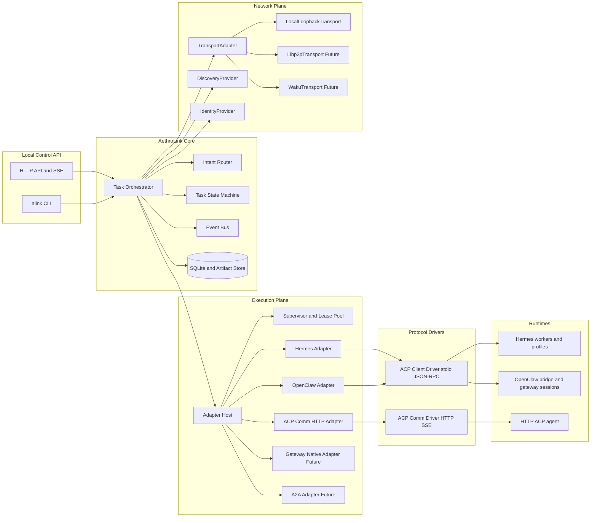

# AethroLink Overview

## Purpose

AethroLink is a local-first orchestration layer for agent-to-agent task delegation that is designed to evolve into a decentralized protocol node over time.

The immediate goal of `v0.1` is to let one runtime send a task to another runtime, stream progress, receive a final response, and automatically start the target runtime if it is down.

The long-term goal is to preserve the same core task model while adding decentralized transport, discovery, identity, and external protocol bindings without rewriting the core.

## Core Principles

1. **Runtime-first, not protocol-first**
   - AethroLink routes tasks to runtimes.
   - Protocols such as Agent Communication Protocol, Agent Client Protocol, A2A, or native gateway APIs are adapter implementation details.

2. **Transport is separate from execution**
   - Runtime execution and network delivery are separate concerns.
   - `v0.1` only needs local loopback transport.
   - Future versions can add libp2p, Waku, or other decentralized transports without changing runtime adapters.

3. **Profiles and sessions are adapter-private**
   - Hermes profiles are not separate public targets.
   - OpenClaw session keys are not separate public targets.
   - These are internal execution contexts owned by the adapter.

4. **AethroLink owns task lifecycle**
   - Local `task_id` is always primary.
   - Remote protocol IDs such as ACP `run_id` are secondary bindings.
   - This allows AethroLink to track work before a target runtime is even started.

5. **Future decentralized compatibility is a design constraint now**
   - Discovery, identity, transport, and runtime execution must be separated from day one.
   - The local MVP should not paint the system into a centralized-only architecture.

## What AethroLink Is

AethroLink is a local control plane and future protocol node with these responsibilities:

- receive task requests
- resolve a target runtime
- ensure the runtime is ready
- launch the runtime if it is down
- dispatch the task using the correct adapter
- stream progress events
- persist task history and artifacts
- support resume and cancel flows

## What AethroLink Is Not in v0.1

The first version does **not** implement:

- blockchain anchoring
- decentralized identity
- on-chain discovery
- libp2p networking
- Waku delivery
- public peer discovery
- verifiable credentials
- dynamic plugin loading

The first version must stay local, deterministic, and testable on one machine.

## High-Level Architecture



## Architecture Layers

### 1. Local Control API

This is the operator-facing surface.

It should expose:

- task submission
- task inspection
- SSE event streaming
- runtime health and lifecycle endpoints
- a small CLI for local development and operations

This API should remain stable even as internal runtime adapters evolve.

### 2. Core Orchestration Layer

This is the heart of AethroLink.

It is responsible for:

- creating local task records
- assigning task IDs
- resolving runtimes using discovery
- invoking the correct runtime adapter
- persisting task state transitions
- consuming event streams from adapters
- exposing ordered task events to clients

The core must remain protocol-agnostic.

### 3. Execution Plane

This layer hosts runtime adapters and process supervision.

Each adapter is responsible for translating a generic AethroLink task into a runtime-specific interaction.

This layer includes:

- adapter lifecycle management
- subprocess launch and health checks
- sticky runtime leases when continuity is needed
- protocol-specific drivers hidden behind adapters

### 4. Protocol Drivers

These are low-level protocol implementations used by adapters.

Examples:

- `acp_client_stdio` for Hermes ACP mode and OpenClaw ACP bridge
- `acp_comm_http` for Agent Communication Protocol servers

Drivers should not contain routing logic or orchestration policy.
They are translation and transport helpers for adapters.

### 5. Network Plane

This layer exists in `v0.1` even though it is mostly local.

It defines abstractions for:

- task delivery between nodes
- runtime discovery
- node identity and signing

In `v0.1`:

- transport = local loopback only
- discovery = static registry
- identity = local node identity

In future versions:

- transport can become libp2p or Waku
- discovery can become DHT, discv5, on-chain, or hybrid
- identity can become DID or wallet-backed

## Public Model

AethroLink should expose **runtimes** as its public execution targets.

It should **not** expose:

- Hermes profiles as separate top-level targets
- OpenClaw session keys as separate top-level targets
- protocol endpoints as the primary public abstraction

### Correct public model

- `hermes`
- `openclaw`
- `researcher_http`

### Incorrect public model

- `hermes_coder`
- `hermes_research`
- `openclaw_main_thread`
- `acp_http_target_1` as a protocol-first object

Profiles and session keys must be passed in `runtime_options`.

## Core Task Model

The core task model must be protocol-agnostic.

Example:

```rust
pub struct TaskEnvelope {
    pub task_id: String,
    pub conversation_id: String,
    pub sender: String,
    pub target_runtime: String,
    pub intent: String,
    pub payload: serde_json::Value,
    pub runtime_options: serde_json::Value,
    pub delivery: DeliveryPolicy,
    pub trace: TraceContext,
    pub metadata: serde_json::Value,
}
```

This is the object that the core orchestrator handles.

Adapters may translate it into:

- ACP runs
- ACP client JSON-RPC requests
- gateway-native requests
- future A2A requests

## Runtime Adapter Model

AethroLink should define a stable runtime adapter trait.

```rust
#[async_trait]
pub trait RuntimeAdapter: Send + Sync {
    fn adapter_name(&self) -> &'static str;
    async fn capabilities(&self) -> anyhow::Result<serde_json::Value>;
    async fn ensure_ready(&self, options: serde_json::Value) -> anyhow::Result<RuntimeLease>;
    async fn submit(&self, task: TaskEnvelope, lease: RuntimeLease) -> anyhow::Result<RemoteHandle>;
    async fn stream_events(
        &self,
        handle: RemoteHandle,
    ) -> anyhow::Result<Pin<Box<dyn Stream<Item = anyhow::Result<TaskEvent>> + Send>>>;
    async fn resume(&self, handle: RemoteHandle, payload: serde_json::Value) -> anyhow::Result<()>;
    async fn cancel(&self, handle: RemoteHandle) -> anyhow::Result<()>;
    async fn health(&self, options: Option<serde_json::Value>) -> anyhow::Result<serde_json::Value>;
}
```

This is the most important boundary in the system.

## Transport Model

Even though `v0.1` is local-only, transport must be modeled as a first-class abstraction.

```rust
#[async_trait]
pub trait TransportAdapter: Send + Sync {
    fn transport_name(&self) -> &'static str;
    async fn publish(&self, envelope: NetworkEnvelope) -> anyhow::Result<()>;
    async fn subscribe(
        &self,
    ) -> anyhow::Result<Pin<Box<dyn Stream<Item = anyhow::Result<NetworkEnvelope>> + Send>>>;
}
```

This prevents the local MVP from hardcoding in-process delivery assumptions into the core.

### `v0.1` implementation

- `LocalLoopbackTransport`

### Future implementations

- `Libp2pTransport`
- `WakuTransport`

## Discovery Model

Discovery must also be abstracted now.

```rust
#[async_trait]
pub trait DiscoveryProvider: Send + Sync {
    async fn resolve_runtime(&self, runtime_id: &str) -> anyhow::Result<RuntimeSpec>;
    async fn list_runtimes(&self) -> anyhow::Result<Vec<RuntimeSpec>>;
}
```

### `v0.1` implementation

- `StaticRegistryDiscovery`

### Future implementations

- DHT-based discovery
- discv5-based discovery
- on-chain pointer discovery
- hybrid local cache and public registry discovery

## Identity Model

Identity must be isolated from runtime adapters and transport.

```rust
#[async_trait]
pub trait IdentityProvider: Send + Sync {
    async fn node_id(&self) -> anyhow::Result<String>;
    async fn sign(&self, payload: &[u8]) -> anyhow::Result<Vec<u8>>;
    async fn verify(&self, node_id: &str, payload: &[u8], signature: &[u8]) -> anyhow::Result<bool>;
}
```

### `v0.1` implementation

- `LocalNodeIdentity`

### Future implementations

- DID-backed identity
- wallet-backed identity
- hardware-backed node identity

## Runtime-Specific Adapter Behavior

### Hermes Adapter

Public runtime ID:

- `hermes`

Rules:

- Hermes profiles are internal execution contexts.
- Profile selection comes from `runtime_options.profile`.
- The adapter owns subprocess pooling and continuity by profile.
- The core should never know about Hermes profile lifecycles directly.

Responsibilities:

- manage sticky workers keyed by profile
- launch Hermes ACP subprocesses on demand
- stream events from ACP client stdio
- relaunch crashed workers when needed
- reconstruct best-effort continuity from AethroLink storage

### OpenClaw Adapter

Public runtime ID:

- `openclaw`

Rules:

- Gateway session keys are internal execution contexts.
- Session selection comes from `runtime_options.session_key`.
- The adapter owns Gateway continuity semantics.

Responsibilities:

- launch or connect to OpenClaw ACP bridge
- persist session continuity metadata
- translate tasks into ACP client interactions
- reuse or create session mappings internally

### ACP Communication HTTP Adapter

Public runtime ID:

- loaded from registry

Rules:

- runtime IDs come from registry-defined runtime specs
- local task identity remains primary
- remote `run_id` and `session_id` are secondary bindings

Responsibilities:

- talk to HTTP ACP servers
- inject AethroLink control metadata as first message part
- stream remote run events
- support resume and cancel

## State Machine

AethroLink should own the local task state machine.

```text
created
-> pending_launch
-> launching
-> ready
-> dispatching
-> running
-> awaiting_input
-> completed | failed | cancelled
```

This local state machine must exist even when no remote protocol ID exists yet.

That is critical for launch-if-down behavior.

## Persistence Model

Use SQLite in `v0.1`.

Tables:

- `runtimes`
- `runtime_leases`
- `tasks`
- `task_events`
- `artifacts`
- `launch_history`

Persistence rules:

- task events are append-only
- large payloads should be stored as artifacts, not embedded in event rows
- artifacts should be stored on local disk
- artifacts should be served over local HTTP URLs

This separation is important for future migration to content-addressed or decentralized storage.

## Registry Model

Use a static `registry.yaml` in `v0.1`.

Example shape:

```yaml
runtimes:
  hermes:
    adapter: hermes
    launch:
      mode: managed
      commands:
        coder: ["coder", "acp"]
        research: ["research", "acp"]
        ops: ["ops", "acp"]
    defaults:
      profile: coder
      session_strategy: sticky-process
    capabilities:
      - code.patch
      - code.review
      - research.topic

  openclaw:
    adapter: openclaw
    launch:
      mode: on_demand
      command:
        [
          "openclaw", "acp",
          "--url", "wss://gateway-host:18789",
          "--token", "env:OPENCLAW_TOKEN"
        ]
    defaults:
      session_key: main
      session_strategy: sticky-session-key
    capabilities:
      - ui.review
      - thread.reply
      - gateway.chat

  researcher_http:
    adapter: acp_comm_http
    endpoint: http://127.0.0.1:9102
    healthcheck: http://127.0.0.1:9102/ping
    launch:
      mode: managed
      command: ["./researcher-agent"]
    capabilities:
      - summarize
      - research.topic
```

## Routing Model

Routing must be based on intent and capabilities.

The core should not route by Hermes profile names or OpenClaw session names directly.

Example:

```yaml
routes:
  code.patch:
    runtime: hermes
    runtime_options:
      profile: coder

  research.topic:
    runtime: hermes
    runtime_options:
      profile: research

  ui.review:
    runtime: openclaw
    runtime_options:
      session_key: design

  summarize:
    runtime: researcher_http
```

## API Surface

The local control API should include:

- `POST /v1/tasks`
- `GET /v1/tasks/:task_id`
- `GET /v1/tasks/:task_id/events`
- `POST /v1/tasks/:task_id/resume`
- `POST /v1/tasks/:task_id/cancel`
- `GET /v1/runtimes`
- `GET /v1/runtimes/:runtime_id/health`
- `POST /v1/runtimes/:runtime_id/start`
- `POST /v1/runtimes/:runtime_id/stop`

## Recommended Rust Workspace

```text
aethrolink-core/
  Cargo.toml
  crates/
    alink-types/
    alink-core/
    alink-storage/
    alink-runtime/
    alink-drivers/
    alink-adapters/
    alink-transport/
    alink-api/
    alink-node/
    alink-cli/
  docs/
    overview.md
  examples/
    registry.yaml
    fake_acp_comm_agent/
    fake_acp_client_agent/
  tests/
    integration/
```

## Crate Responsibilities

### `alink-types`

Shared models and traits.

### `alink-core`

Orchestrator, router, state machine, event bus.

### `alink-storage`

SQLite repositories, artifact store, projections.

### `alink-runtime`

Supervisor, process launching, lease pooling, health checks.

### `alink-drivers`

Protocol driver implementations:

- ACP client stdio
- ACP communication HTTP

### `alink-adapters`

Runtime adapter implementations:

- HermesAdapter
- OpenClawAdapter
- AcpCommHttpAdapter
- GatewayNativeAdapter stub
- A2AAdapter stub

### `alink-transport`

Transport abstractions and local loopback transport.

### `alink-api`

HTTP API and SSE surfaces.

### `alink-node`

Daemon binary.

### `alink-cli`

Operator CLI.

## Testing Requirements

The system must be testable without real Hermes or real OpenClaw.

Required testing approach:

- fake ACP client stdio servers in Rust
- fake ACP communication HTTP server in Rust
- integration tests for:
  - Hermes profile routing through runtime options
  - OpenClaw session continuity through runtime options
  - auto-launch when runtime is down
  - resume and cancel flows
  - ordered SSE event streaming
  - persistence across process restart

## Design Constraints for Future Decentralization

These constraints must be respected in `v0.1`:

1. Do not let runtime adapters depend on HTTP route code.
2. Do not let transport-specific types leak into runtime adapters.
3. Do not let protocol-specific IDs become primary local IDs.
4. Keep `NetworkEnvelope` transport-agnostic.
5. Keep discovery and identity behind real traits, not placeholders.
6. Keep storage abstract enough that artifact backends can change later.
7. Keep the local orchestrator valid even when remote runtimes are unavailable.

## Summary

AethroLink `v0.1` should be implemented as a **local-first Rust orchestration node** with:

- a stable runtime-based task API
- runtime adapters for Hermes, OpenClaw, and HTTP ACP runtimes
- a separate transport abstraction with only local loopback implemented initially
- static registry-based discovery
- local identity abstraction
- SQLite-backed event persistence
- a design that can later evolve into a decentralized protocol node without replacing the core

This is the architecture that the implementation should follow.
